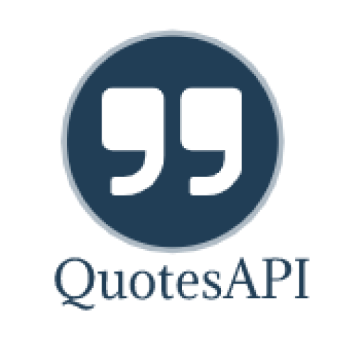

  

<h3 align="center">Quotes api Documentation</h3>

---

## 📝 Table of Contents

- [About](#about)
- [Deployment](#deployment)
- [Built Using](#built_using)
- [Authors](#authors)
- [Acknowledgments](#acknowledgement)

## 🧐 About 

The purpose of this repository is to Show examples and documenatation of [api](https://quotesapivsk.herokuapp.com/quotes) created by me.

## 🚀 Deployment 

Quotes API Link: https://quotesapivsk.herokuapp.com

Quotes API Documentation: https://vinaykanase.github.io/QuotesApi-Documentation/

## ⛏️ Built Using 

- [ReactJs](https://reactjs.org/) - Web Framework

## ✍️ Authors 

- [@VinayKanase](https://github.com/VinayKanase)

See also the list of [contributors](https://github.com/VinayKanase/QuotesApi-Documentation/contributors) who participated in this project.

## 🎉 Acknowledgements 

- References
  - [Unsplash](https://unsplash.com/)
  - [UnDraw](https://undraw.co/)
  - [Giphy](https://giphy.com/)
